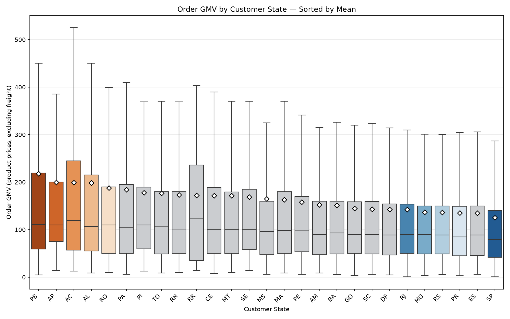
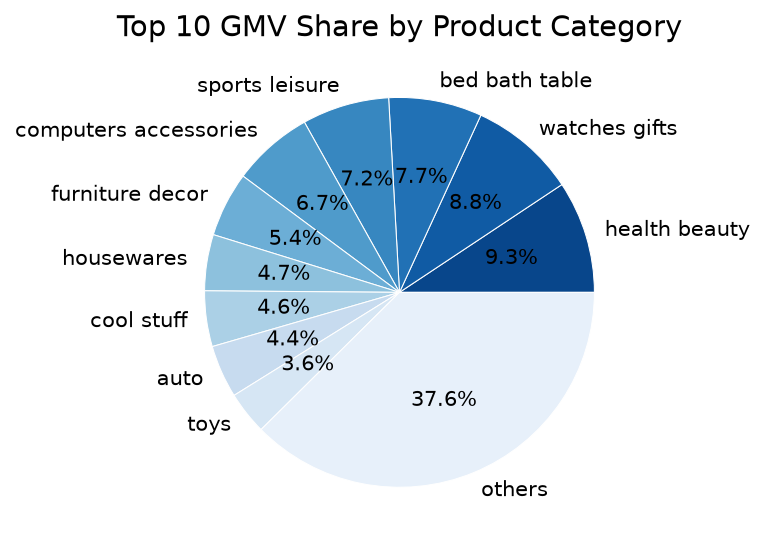
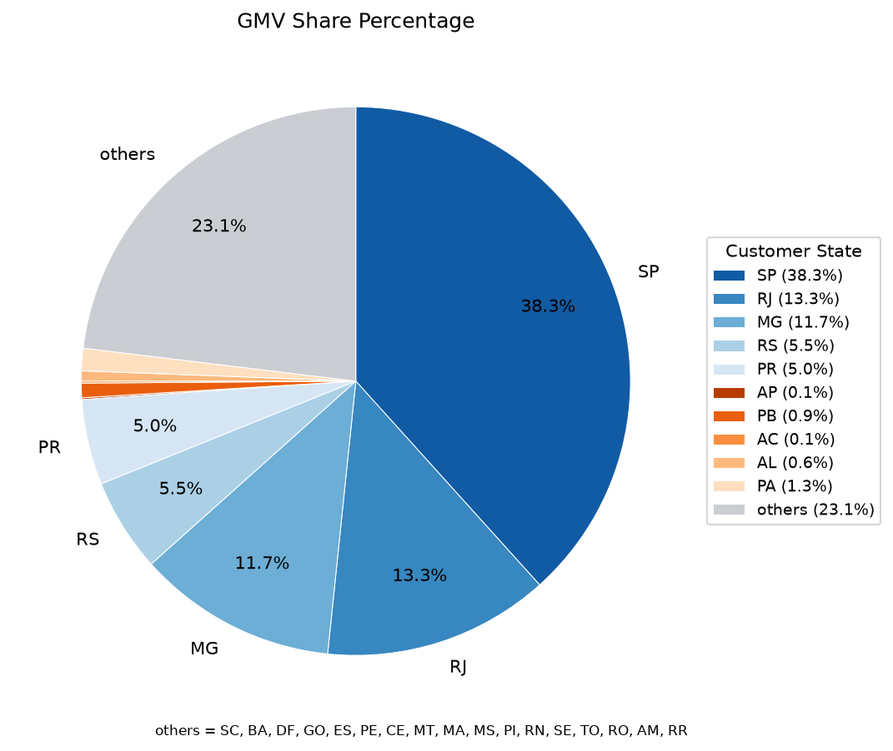
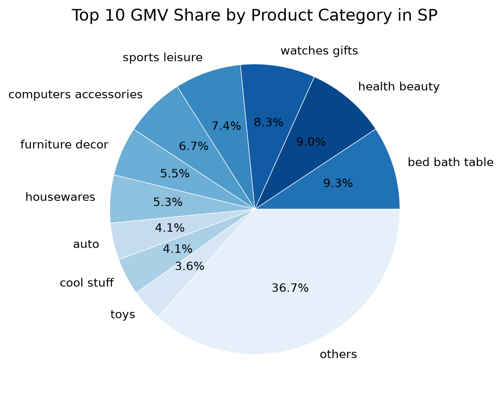
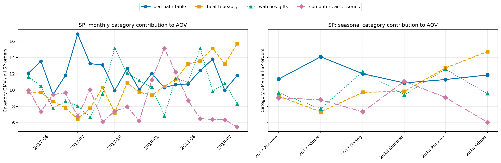
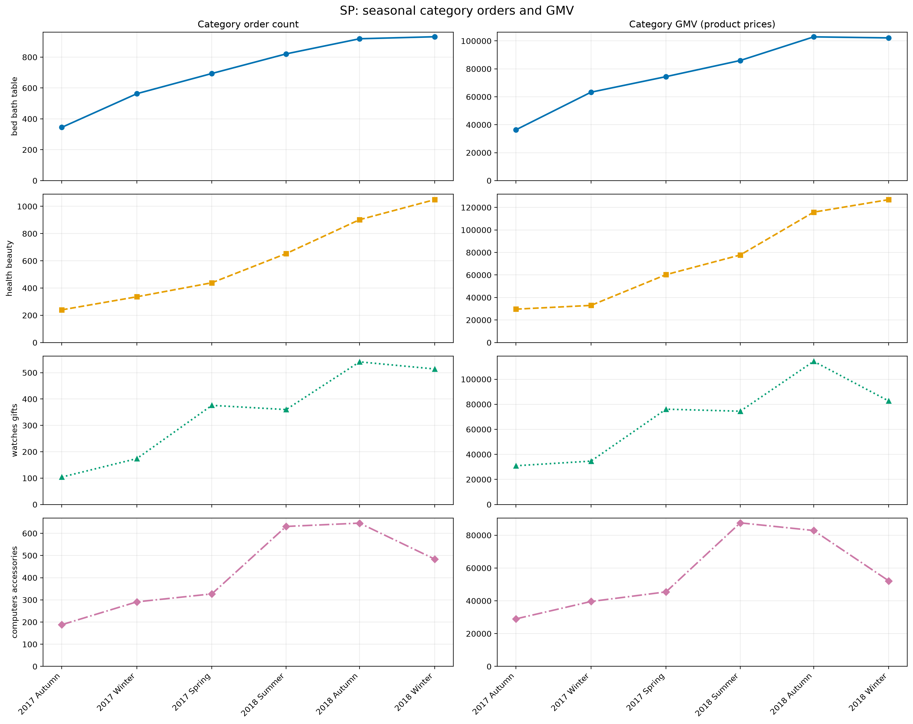

# AWS_Python_data_analysis

Olist のブラジル EC データを用いて、**低評価レビューのリスクを分析・予測し、その要因と将来の購買・GMVとの関係を検証する**データ分析ポートフォリオです。

AWS（Amazon S3 / Athena）と SQL で分析用データを作成し、Python（Positron / Jupyter Notebook）で統計分析・機械学習・売上構造分析を行っています。

## 1. 分析で明らかにしたいこと

> **注文・配送・商品・地域情報から低評価になりやすい注文を識別し、  
> その要因や対象セグメントを理解したうえで、  
> 低評価とその後の再購入・将来 GMV の関係を明らかにできるか。**

本プロジェクトは、次の2段階で進めます。

1. **予測分析**
   - 低評価レビュー（1〜2点）の予測
   - Baseline モデルから追加特徴量を加えた Improved モデルへの改善
   - 将来期間を用いた時系列 Holdout 評価

2. **ビジネスへの影響分析**
   - 低評価 / 高リスク注文と、その後の再購入・注文数・将来 GMV との関係を確認
   - 施策効果そのものではなく、低評価対策が関係しうる売上規模・顧客行動を定量的に把握

> **注意**  
> Olist データは観察データであり、介入実験の結果は含まれていません。  
> そのため、本プロジェクトでは「施策によって GMV が増加する」といった因果効果は直接推定しません。

---

## 2. 分析全体の流れ

```text
Olist Dataset
    │
    ▼
Amazon S3
    │
    ▼
Amazon Athena / SQL
    │
    ▼
分析用データ作成
    │
    ├───────────────────────────────┐
    ▼                               ▼
顧客体験に関する分析      　　 売上・顧客層の探索
・注文金額                         ・GMV / AOV
・送料                             ・顧客州
・配送遅延                         ・商品カテゴリ
・レビュー評価                     ・月 / 季節
    │                              ・商品構成
    ▼                               │
低評価予測モデル           │
    │                               │
    └──────────────┬────────────────┘
                   ▼
              特徴量の追加
                   │
                   ▼
              モデルの改良
                   │
                   ▼
            　将来期間で評価
                   │
                   ▼
     実際のレビュー・再購入・将来売上を確認
```

## 現在位置

現在は以下まで完了しています。

- Customer Experience Analysis
- Baseline 低評価予測モデル
- Train / Validation / Test に分けたモデル評価
- GMV / AOV の基準集計
- 州・カテゴリ・時期・商品構成の探索
- Notebook 共通処理の `src/` への整理
- SP 州の一部カテゴリについて、GMV 変化を注文数と注文あたり GMV に分解

現在は、**売上探索を追加特徴量候補の整理につなげ、低評価予測モデル改善へ戻る段階**です。

---

## 3. 使用データ
- **データセット:** [Brazilian E-Commerce Public Dataset by Olist](https://www.kaggle.com/datasets/olistbr/brazilian-ecommerce)
- **主なデータ:** 注文、商品、送料、支払い、レビュー、配送に関する情報（orders / customers / order_items / payments / reviews / products / sellers）
- **ライセンス:** [CC BY-NC-SA 4.0](https://creativecommons.org/licenses/by-nc-sa/4.0/)
- **データの保管:** 元データと分析用CSVは`data/`に保存し、GitHubには含めていません。`data/`は`.gitignore`で除外しています。

---

## 4. 使用技術・分析環境

- **AWS:** Amazon S3、Amazon Athena
- **SQL:** Athena用クエリ
- **分析:** Python、R、Positron、Jupyter Notebook
- **分析手法:** 記述統計、箱ひげ図、Kruskal–Wallis検定、Dunn検定（Bonferroni・Holm補正）、ロジスティック回帰

---

## 5. リポジトリ構成

```text
AWS_Python_data_analysis/
├── docs/
│   └── development_log.md
├── images/
├── notebooks/
├── sql/
│   └── athena/
├── src/
├── data/                  # Git管理対象外
├── .gitignore
├── requirements.txt
└── README.md
```

- `notebooks/`: 分析の問い・入力・結果・解釈
- `src/`: 再利用する集計・統計・モデル評価・描画関数
- `sql/athena/`: S3 上のデータを分析用に加工する SQL
- `docs/development_log.md`: 試行錯誤を含む開発過程
- `images/`: README / Notebook で使用する図
- `data/`: ローカル分析用データ。GitHub には含めない


必要なライブラリ等は以下を実行することでインストールされます。

```bash
pip install -r requirements.txt
```

また、Athena で使用した SQL は `sql/athena/` に保存しています。

AWS のバケット名・認証情報等は公開リポジトリには含めていません。

---
 
## 6. 主な分析結果

### 6.1 注文金額・送料とレビュー評価

注文に複数の商品が含まれることを考慮し、商品明細を注文単位へ集約してからレビュー情報と結合しました。

| Variable | Kruskal–Wallis H | p-value | ε² |
|---|---:|---:|---:|
| Total Price（価格） | 299.1710 | < 0.001 | 0.003015 |
| Total Freight （送料）| 932.2902 | < 0.001 | 0.009481 |

統計的な差は確認されましたが、効果量は小さく、**大規模サンプルでは p 値だけでなく効果量も確認する必要がある**ことを確認しました。

Notebook: [`review_price_analysis.ipynb`](notebooks/review_price_analysis.ipynb)

---

### 6.2 配送遅延とレビュー評価

```text
delivery_delay_days
= actual_delivery_date - estimated_delivery_date
```

- 負の値: 予定より早く配送
- 0: 予定どおり
- 正の値: 予定より遅く配送

分析対象は 95,830 注文です。

| レビュー評価 | 配送遅延中央値 |
|---:|---:|
| 1 | -7 days |
| 2 | -10 days |
| 3 | -11 days |
| 4 | -12 days |
| 5 | -13 days |

- Kruskal–Wallis: H = 3890.1397, p < 0.001
- ε² = 0.040555
- Dunn 検定では全レビュー評価群間で有意差
- Review 1 vs 5 のペアでは中程度の効果量（δ = 0.3710）を確認

低評価の注文ほど、予定配送日との差が遅延側に位置する傾向が確認されました。

ただし、これは観察データ上の関連であり、配送遅延が低評価を引き起こしたことを示すものではありません。

Notebook: [`review_delivery_analysis.ipynb`](notebooks/review_delivery_analysis.ipynb)

## 7. 低評価予測の基準モデル

レビュー 1〜2 点を低評価として二値分類しました。

```text
low_review = 1  if review_score <= 2
low_review = 0  if review_score >= 3
```

### 使用した特徴量

- `注文金額`
- `送料`
- `配送遅延日数`

### モデル

- Logistic Regression（ロジスティック回帰）
- StandardScaler を Train データのみに fit
- Train / Validation / Test = 60 / 20 / 20
- Validation 上で F1-score が最大となるしきい値を選択
- threshold = **0.24**

### テストデータでの評価結果

| テスト指標 | 結果 |
|---|---:|
| Accuracy | 0.8860 |
| Precision | 0.5919 |
| Recall | 0.3472 |
| F1-score | 0.4377 |
| ROC-AUC | 0.6838 |

Test データでは、低評価 2,448 件のうち 850 件を検出しました。

低評価率は約 12.77% とクラス不均衡があるため、Accuracy だけでなく Precision / Recall / F1 / ROC-AUC を併記しています。

### 標準化後のオッズ比

| 特徴量 | オッズ比 |
|---|---:|
| 注文金額 | 1.014 |
| 送料 | 1.265 |
| 配送遅延日数 | 2.154 |

今回の3特徴量では配送遅延日数の関連が最も大きく見られました。

### このモデルの限界

`delivery_delay_days` は配送完了後に確定する情報です。

そのため、この Baseline モデルは「購入時点の予測モデル」ではなく、**配送完了後〜レビュー投稿前のフォロー対象候補を考えるモデル**として解釈する方が自然です。

Notebook: [`predict_low_review.ipynb`](notebooks/predict_low_review.ipynb)

---

## 8. 売上・特徴量候補の探索

この売上分析は、販促効果を直接推定するためではなく、

> **低評価予測モデルの追加特徴量候補と、後続のビジネスでの影響分析で確認すべきセグメントを整理する**

目的で実施しています。

### 8.1 売上（GMV）と平均注文額（AOV）の 基準集計

GMV：商品価格の合計
AOV：1注文あたりの平均金額

この分析では、GMVとAOVを以下のように定義しています。

```text
GMV = Σ item price
AOV = GMV / unique orders
```

- 対象注文: 96,478
- 期間: 2016-09 〜 2018-08
- GMV: 13,221,498.11
- 送料: 2,198,275.64
- 全体 AOV: 137.04
- 最大州: SP
  - 注文数: 40,501
  - GMV: 5,067,633.16
  - AOV: 125.12

Notebook: [`sales_baseline_by_month_state.ipynb`](notebooks/sales_baseline_by_month_state.ipynb)

### 8.2 州別の注文金額比較

| 州 | 注文数 | 平均注文額 | 注文額中央値 |
|---|---:|---:|---:|
| PB | 517 | 217.77 | 110.32 |
| AP | 67 | 199.62 | 109.90 |
| AC | 80 | 199.14 | 119.45 |
| AL | 397 | 198.63 | 106.90 |
| PA | 946 | 184.43 | 105.00 |
| SP | 40,501 | 125.12 | 79.50 |




箱の中央線は**注文1件ごとのGMVの中央値**、白いひし形は平均値です。

- Kruskal–Wallis: H = 732.3388, p < 0.001
- 27 州 351 ペアのうち、Dunn 検定（Holm 補正）で 77 ペアが有意
- SP と AP / AC / PB / AL の差は統計的に確認されたが、効果量は小さい

小規模州では少数注文の影響が大きいため、平均注文額が高いことだけで施策対象とは判断していません。

Notebook: [`order_level_sales_by_state.ipynb`](notebooks/order_level_sales_by_state.ipynb)

---

### 8.3  州別・商品カテゴリ別の分析

- 27 州
- 74 カテゴリ（`カテゴリ未分類` を含む）
- 1,388 州 × カテゴリ

全体 GMV 上位:

1. `health_beauty`: 1,233,131.72
2. `watches_gifts`: 1,166,176.98
3. `bed_bath_table`: 1,023,434.76



州別 GMV 上位:

- SP: 5,067,633.16
- RJ: 1,759,651.13
- MG: 1,552,481.83




全体と州内で上位カテゴリが異なり、地域によって商品構成が異なる可能性を確認しました。

Notebook: [`sales_by_category_state.ipynb`](notebooks/sales_by_category_state.ipynb)

---

### 8.4 商品カテゴリの購入割合

```text
カテゴリ購入割合
= そのカテゴリを含む注文数 / 州全体の注文数
```

例: `bed_bath_table`

| 州 | カテゴリ購入割合 |
|---|---:|
| SP | 10.73% |
| AL | 4.53% |
| PA | 3.59% |



売上額だけでなく、**その州でそのカテゴリを含む注文がどの程度あるか**を分けて確認しています。

---

### 8.5 月別・季節別の商品カテゴリ分析

ブラジルの季節区分:

- 夏: 12月–2月
- 秋: 3月–5月
- 冬: 6月–8月
- 春: 9月–11月

**あるカテゴリが州全体の平均注文額（AOV）にどれくらい寄与しているか**を以下で表します。

```text
平均注文額へのカテゴリ寄与額
= カテゴリGMV / 州全体の注文数
```

さらに、

```text
平均注文額へのカテゴリ寄与額
= カテゴリ購入割合
  × カテゴリGMV / カテゴリ注文数
```

と分解できます。これにより、  
「そのカテゴリがよく買われているから寄与が大きいのか（カテゴリ購入割合）」  
「そのカテゴリを買ったときの金額が高いから寄与が大きいのか（カテゴリあたりのGMV）」  
を分けて検討しています。



SP の `health_beauty` では 2017 年冬 → 2018 年冬に以下の変化を確認しました。

| 指標 | 2017 年冬 | 2018 年冬 |
|---|---:|---:|
| カテゴリ注文数 | 336 | 1,049 |
| 州全体の注文数 | 4,492 | 8,617 |
| カテゴリ購入割合 | 7.48% | 12.17% |
| カテゴリGMV / カテゴリ注文数 | 98.14 | 120.99 |
| AOV 寄与額 | 7.34 | 14.73 |



このことから、SP州のhealth_beautyは、2018年冬には**より多くの注文で買われるようになり、かつ1注文あたりのカテゴリGMVも高くなった**ため、州全体の平均注文額への寄与が大きくなったと解釈できます。

Notebook: [`monthly_seasonal_category_by_state.ipynb`](notebooks/monthly_seasonal_category_by_state.ipynb)

---

### 8.6 GMV変化の要因分解

ここでは、GMVが増えた理由を「注文件数」と「1注文あたり金額」に分けています。

```text
GMV = カテゴリ注文数 × カテゴリ注文数あたりのGMV
```

SP の `health_beauty` では、2017 年冬 → 2018 年冬の GMV 増加 93,946.95 を、

- 注文件数変化分: 69,974.50
- 注文あたり GMV 変化分: 23,972.45

に分解しました。

これは変化の構造を記述するものであり、販促・価格変更などの因果効果を推定するものではありません。

---

## 9. 今後の低評価予測モデルモデル改善計画

### Step 1. 予測する時点を決める

現時点では、

> **配送完了後〜レビュー投稿前**

を予測時点の候補としています。

### Step 2. 追加する特徴量候補

基準:

- 価格
- 送料
- 配送遅延

追加候補:

- 顧客の州
- 商品カテゴリ
- 購入月 / 季節
- 商品点数
- カテゴリ数
- 送料割合
- 販売者情報
- 支払い方法

追加する際は、**予測時点で利用可能な情報だけを使用し、データリークを避けます。**

### Step 3. 時系列でデータを分ける

```text
Past -----------------------------> Future

Train
████████████

Validation
            ████

Holdout Test
                ████
```

過去期間でモデルを作成し、未来期間を最終評価用として保持します。

### Step 4. 基準モデルと改良モデルの比較

同じ Holdout 期間で、

- ROC-AUC
- PR-AUC / Average Precision
- Precision
- Recall
- F1-score
- Calibration

などを比較します。

---

## 10. 低評価とその後の購買・売上との関係分析

`customer_unique_id` を用いて、

```text
注文
  ↓
低評価 / 高リスク
  ↓
未来の時点
  ↓
再購入しているか
注文数に変化はあるか
GMVに変化はあるか
```

という流れを想定しています。

候補指標:

- 再購入率
- 将来 90 日 / 180 日の注文数
- 将来 GMV
- 次回購入までの日数

ここで確認するのは **低評価と将来購買の関連** です。

モデルで顧客をフォローした結果 GMV が増えた、という施策効果を直接示すものではありません。

---

## 11. 分析上の限界・注意点

- 観察データのため、因果効果は直接推定できない
- GMV は商品価格合計であり、原価・広告費・販売手数料等を含まない
- 利益への効果は評価できない
- Baseline モデルの配送遅延日数は配送後情報
- 低評価は 12.77% でクラス不均衡がある
- 州によって注文数が大きく異なる
- 小規模州では少数注文の影響が大きい
- 商品カテゴリには `uncategorized` が存在する
- 季節性は十分な年数を繰り返し観測していないため確定できない
- 将来購買分析でも、低評価と売上の「関連」と施策の「効果」は区別する必要がある

---

## 12. 現在の進捗

**完了済み**

- AWS S3 / Athena 分析環境
- Athena SQL によるデータ加工
- レビュー評価 × 注文金額 / 送料
- レビュー評価 × 配送遅延
- Baseline Logistic Regression
- Train / Validation / Test 評価
- 月別・州別 GMV / AOV
- 州別注文額分布
- 州 × 商品カテゴリ分析
- 月別 / 季節別カテゴリ分析
- SP カテゴリ GMV 変化分解
- Notebook / `src/` 整理

**今後の予定**

1. 商品構成分析を区切る
2. 追加特徴量候補を整理
3. 予測時点を固定
4. 時系列 Train / Validation / Holdout を設計
5. Baseline モデルを時系列分割で再評価
6. Improved モデルを作成
7. Baseline vs Improved を比較
8. Holdout で実レビューを評価
9. 再購入・将来 GMV との関連を分析
10. 最終的な Business Insight を整理

---

## 13. 開発記録

詳細な試行錯誤・各ステップの結果は以下に記録しています。

[`docs/development_log.md`](docs/development_log.md)