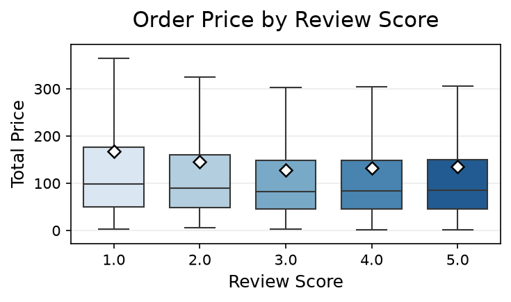
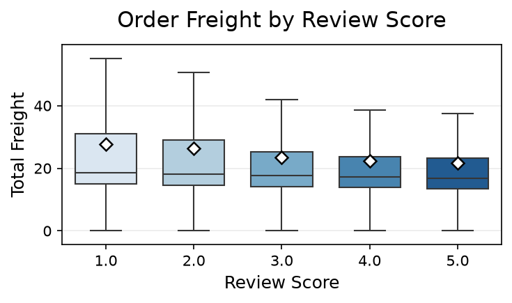
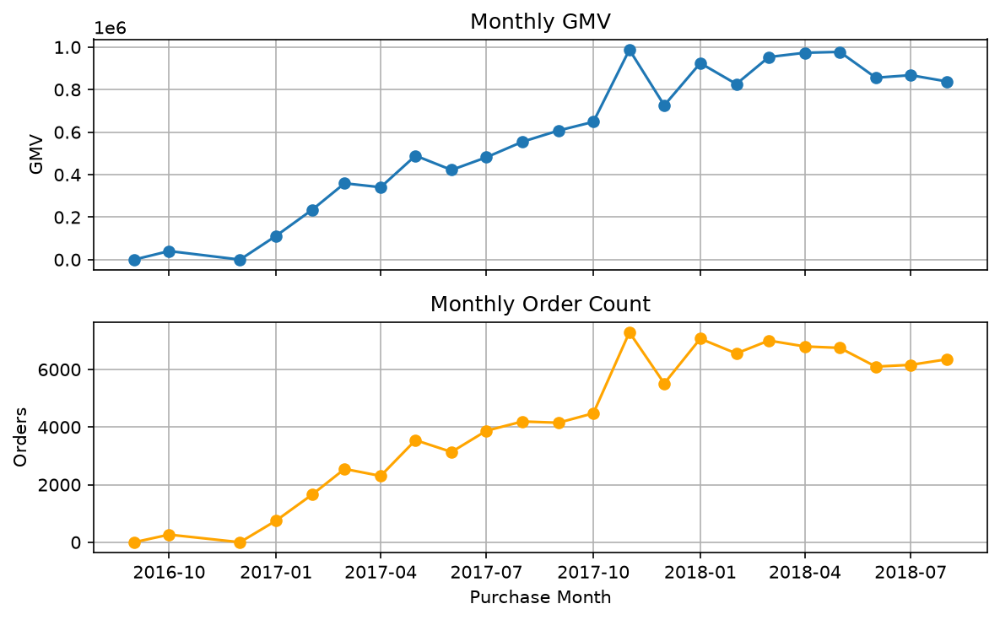
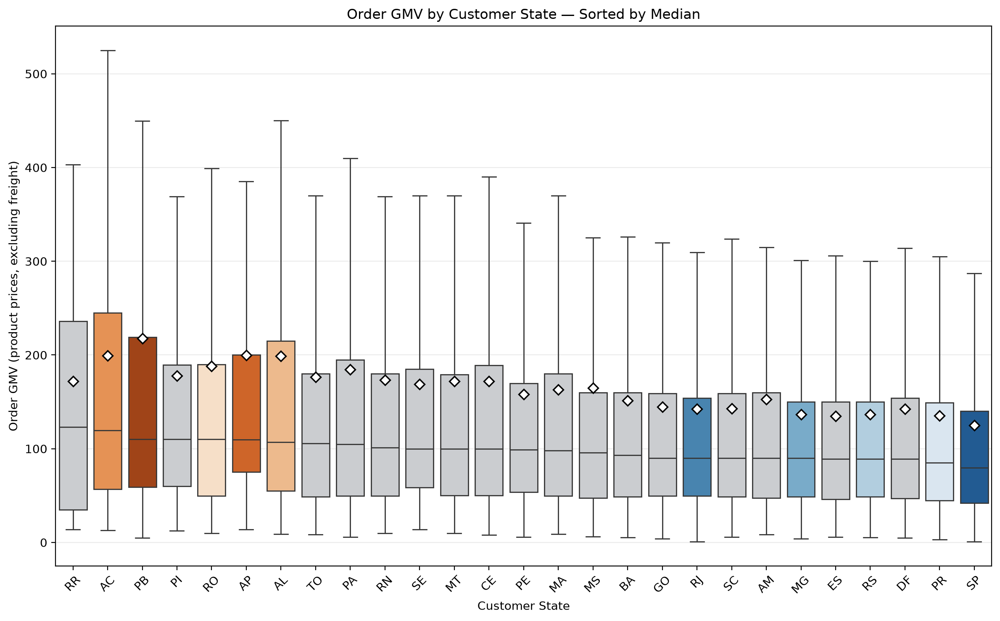

# AWS_Python_data_analysis

OlistのブラジルECサイトデータを使い、売上増加につながる改善候補を探るプロジェクトです。AWS（S3・Athena）とSQLでデータを準備し、Python（Positron / Jupyter Notebook）で注文・顧客体験を分析します。売上指標の基準値を作り、地域・商品・販売者などの違いから施策仮説を立て、実施可能な施策は比較検証することを目指します。

## プロジェクトの目的
【１】配送遅延の解消による顧客体験向上（低評価の防止）  
【２】高単価な州・特定カテゴリへの販促最適化   

  の2軸から、GMV（総流通額）を最大化するための具体的な改善施策を特定すること

そのための分析として以下を実施する。
- 配送遅延とレビューとの関連を探る
- 売上（GMV）・注文数・平均注文額の基準値と変化を把握する
- 地域・商品カテゴリ・販売者などに分け、売上機会と顧客体験の課題を探る


## 現在位置と次の段階

月別・州別のGMVと注文数を基準値として確認し、州×商品カテゴリの構成と、州別の注文単位の金額分布を調べています。注文額の差を売上機会と直結させず、注文数・GMV・商品構成・顧客体験も合わせて次の問いを整理する段階です。

1. 配送遅延と低評価の関係を確認（実施済み）
2. 月別・州別の売上基準値を確認（実施済み）
3. 州×商品カテゴリのGMVと注文数を確認（実施済み）
4. カテゴリを含む注文の割合と州内GMVシェアを比較（実施済み）
5. 注文単位のデータを照合し、州別の注文額の中央値と分布を確認（実施済み）
6. 確認した差について、次に調べる要因と必要なデータを選定する
7. 施策の実施条件と費用を整理し、実施できる場合は効果を比較検証する

## データ

- **データセット:** [Brazilian E-Commerce Public Dataset by Olist](https://www.kaggle.com/datasets/olistbr/brazilian-ecommerce)
- **主なデータ:** 注文、商品、送料、支払い、レビュー、配送に関する情報
- **ライセンス:** [CC BY-NC-SA 4.0](https://creativecommons.org/licenses/by-nc-sa/4.0/)
- **出典表記:** Olist, “Brazilian E-Commerce Public Dataset by Olist” ([Kaggle](https://www.kaggle.com/datasets/olistbr/brazilian-ecommerce)). このプロジェクトで加工したデータを共有する場合は、出典・ライセンス・変更内容を明記し、ライセンス条件を確認します。
- **データの保管:** 元データと注文単位の分析用CSVはローカルの`data/`に置き、GitHubには含めません。`data/`は`.gitignore`で除外しています。

## 使用技術

- **AWS:** Amazon S3、Amazon Athena
- **SQL:** Athena用クエリ
- **分析:** Python、R、Positron、Jupyter Notebook
- **分析手法:** 記述統計、箱ひげ図、Kruskal–Wallis検定、Dunn検定（Bonferroni・Holm補正）、ロジスティック回帰

## リポジトリ構成

```text
AWS_data_analysis/
├── data/             # ローカル分析データ（Git管理対象外）
├── docs/
│   └── development_log.md
├── images/           # 分析図
├── notebooks/        # Python / Rによる分析
├── sql/
│   └── athena/       # Athena用SQL
├── src/              # 分析用コード
└── README.md
```

## 分析内容

### 注文金額・送料とレビュー評価

注文に複数の商品が含まれることを考慮し、商品単位の明細を注文単位に集約してからレビュー情報と結合しました。レビュー評価別に注文金額と送料を比較しています。

- [レビュー評価別の注文金額・送料分析Notebook](notebooks/review_price_analysis.ipynb)



【注文金額】
- Kruskal–Wallis検定：H = 299.1710、p < 0.001
- Dunn検定（Bonferroni補正）：1点 -> すべての評価と有意、2点 ->  3点、4点と有意
- 全体の効果量：ε² = 0.003015

【送料】
- Kruskal–Wallis検定：H = 932.2902、p < 0.001
- Dunn検定（Bonferroni補正）：1点 -> すべての評価と有意、2点 ->  3点、4点、5点と有意
- 全体の効果量：ε² = 0.009481

Kruskal–Wallis検定では、注文金額・送料ともにレビュー評価群間で統計的な差が確認されました。一方、Kruskal-Wallis検定の効果量 ε² は、注文金額、送料、どちらも小さい値でした。Dunn比較で有意になったペアの効果量は、送料のレビューの1点vs.5点が（δ = 0.1728）と小さい値でした。

### 配送遅延とレビュー評価

実配送日と予定配送日の差を`delivery_delay_days`として集計しました。負の値は予定より早い配送、0は予定どおり、正の値は予定より遅い配送です。

- [配送遅延分析Notebook](notebooks/review_delivery_analysis.ipynb)
- 分析対象：95,830注文
- レビュー評価別の中央値：1点 -7日、2点 -10日、3点 -11日、4点 -12日、5点 -13日
- Kruskal–Wallis検定：H = 3890.1397、p < 0.001
- Dunn検定（Bonferroni補正）：全てのレビュー評価群間で有意差
- Kruskal-Wallis検定効果量：ε² = 0.040555

Kruskal-Wallis検定では、レビュー評価群間で統計的な差が確認されました。Dunn検定による多重比較でも、すべてのレビュー評価群間に有意差がありました。Kruskal-Wallis検定の効果量は小さい値でしたが、Dunn検定後の効果量測定では、レビュー1点vs.5点の間に中程度（δ = 0.3710）の効果量を確認しました。レビュー評価が高いグループほど、配送遅延が少ないことが示唆されました。

この結果は配送状況を顧客体験の改善候補として検討する根拠になりますが、外れ値やレビュー評価ごとの件数の偏りがあり、この分析だけで配送遅延が低評価の原因だとは判断できません。施策の優先順位を決めるには、地域・商品・販売者など他の要因もあわせた検討が必要です。

### 低評価予測モデル

- [低評価予測Notebook](notebooks/predict_low_review.ipynb)
- 低評価：レビュー1～2点（`low_review = 1`）
- 説明変数：注文金額、送料、配送遅延日数
- モデル：ロジスティック回帰
- 評価：混同行列、Accuracy、Precision、Recall、F1-score、ROC-AUC、ROC曲線、Precision–Recall曲線

データ中の低評価は12.77%、通常評価は87.23%でした。クラスに偏りがあるため、Accuracyだけでは性能を判断せず、PrecisionやRecallなども確認しています。

Train / Validation / Testを60 / 20 / 20に分割し、ValidationでF1が最大となったしきい値0.24を選び、Testで最終評価しました。

| Test指標 | 結果 |
|---|---:|
| Accuracy | 0.8860 |
| Precision | 0.5919 |
| Recall | 0.3472 |
| F1-score | 0.4377 |
| ROC-AUC | 0.6838 |

このモデルは低評価の傾向を一定程度識別しましたが、低評価注文の約65%は見逃しています。現時点では改善施策の対象を選ぶための探索分析であり、売上増加や配送改善の因果効果を示すものではありません。説明変数には配送後に確定する配送遅延日数が含まれるため、購入前の予測にはそのまま使えません。

### 売上増加に向けた基準分析

配達済み注文の商品価格合計をGMV（売上の代理指標）とし、購入月・顧客州別に注文数、GMV、平均注文額を集計しました。注文商品価格の合計と注文数から計算した平均注文額は、全体で137.04（データ上の金額単位）でした。

- 対象：96,478注文、2016年9月～2018年8月の23か月
- GMV合計：13,221,498.11
- 送料合計：2,198,275.64（GMVとは分けて集計）
- 注文数・GMVが最大の州：SP（40,501注文、GMV 5,067,633.16）
- 月別GMVが最大：2017年11月（987,765.37、7,289注文）
- [売上基準分析Notebook](notebooks/sales_baseline_by_month_state.ipynb)
- [月別・州別の売上基準集計SQL](sql/athena/14_sales_baseline_by_month_state.sql)
- 補助図：[月×州GMVの分布](images/Monthly_GMV_Distribution_by_State.png)



月別のGMVと注文数を同じ期間で確認できます。初期月は注文数が少ないため、通常月の傾向と分けて読みます。

州別の平均注文額は、その州のGMV合計を注文数合計で割って求めます。SPは125.12で全体平均137.04を下回り、ALは198.63（397注文）、PAは184.43（946注文）でした。AL・PAは注文数が少ないため、平均注文額の差だけから市場機会を判断しません。[月別平均注文額の分布（平均順）](images/Monthly_AOV_Distribution_by_State_Sorted_by_Mean.png)と[同（中央値順）](images/Monthly_AOV_Distribution_by_State_Sorted_by_Median.png)は、各州の月ごとの変動を見る補助資料です。図中の中央値は注文1件ごとの金額の中央値ではありません。利益・原価・販促費の情報がないため、利益額や利益への効果も測定できません。2016年の初期月は注文数が非常に少なく、月ごとの比較では慎重に扱います。


この図は州別の**GMV規模**を示します。注文1件あたりの金額や利益の順位を示すものではありません。

州別の注文額の中央値を確認するため、[注文単位の売上データを作るSQL](sql/athena/19_order_level_sales_by_state.sql)を実行しました。月×州の集計済みCSVから注文額の中央値は復元できないためです。注文単位CSVは96,478行で、注文IDの重複はありません。GMV合計13,221,498.11と送料合計2,198,275.64は既存の月×州集計と一致しました。

[州別注文額の分析Notebook](notebooks/order_level_sales_by_state.ipynb)では、注文ごとのGMVを州別に比較しました。下の箱ひげ図は州別の注文額中央値が高い順に並べています。[平均順の図](images/Order_Value_Distribution_by_State_Sorted_by_Mean.png)も参照できます。外れ値の点は図では非表示ですが、集計・検定から除外していません。図は[保存用コード](src/order_value_state_plots.py)から再作成できます。

| 州 | 注文数 | 平均注文額 | 注文額の中央値 |
|---|---:|---:|---:|
| PB | 517 | 217.77 | 110.32 |
| AP | 67 | 199.62 | 109.90 |
| AC | 80 | 199.14 | 119.45 |
| AL | 397 | 198.63 | 106.90 |
| PA | 946 | 184.43 | 105.00 |
| SP | 40,501 | 125.12 | 79.50 |



箱の中央線は**注文1件ごとのGMVの中央値**、白いひし形は平均値です。先ほどの月×州の平均注文額の箱ひげ図とは集計単位が異なります。

27州の注文額分布にはKruskal–Wallis検定で差が見られました（H = 732.3388、p = 1.18 × 10⁻¹³⁷）。Dunn検定（Holm補正）後、SPとAP・AC・PB・ALの各比較でも差が見られ、順位に基づく効果量の絶対値はそれぞれ0.278、0.241、0.231、0.198でした。Notebookの区分ではいずれも小さい効果量です。AP・ACは注文件数が少なく、注文額が高いことだけで販促の優先州や売上増加効果は判断しません。GMV規模が大きいSPと、1注文あたりの金額が高い州は別の観点で評価します。

配送遅延分析の対象95,830注文とは抽出条件が異なります。売上集計対象96,478注文のうち、配送遅延分析で必要な配送日と有効レビューの両方がそろう注文は95,824件でした。分析ごとに必要な情報が異なるため、対象件数を直接比較せず、各分析で条件を明記します。

### 商品カテゴリ・顧客州別の売上

商品明細を商品・カテゴリ翻訳テーブルと結合し、配達済み注文を顧客州・カテゴリ別に集計しました。NotebookでCSVの列・型・欠損・重複を確認した後、商品カテゴリ別と州別、州×カテゴリ別にGMVを集計しています。

- 集計結果：1,388行、27州、未分類を含む74カテゴリ
- 全体GMV上位：`health_beauty` 1,233,131.72、`watches_gifts` 1,166,176.98、`bed_bath_table` 1,023,434.76
- GMV上位3州：SP 5,067,633.16、RJ 1,759,651.13、MG 1,552,481.83
- 州内GMV上位カテゴリ：SPは`bed_bath_table` 472,238.07、RJは`watches_gifts` 174,895.01、MGは`health_beauty` 154,324.15
- 未分類カテゴリ：GMV 170,726.63（全体の約1.29%）
- [商品カテゴリ・顧客州別の分析Notebook](notebooks/sales_by_category_state.ipynb)
- [商品カテゴリ・顧客州別の売上集計SQL](sql/athena/18_sales_by_category_state.sql)
- 州内カテゴリ別GMV：[SP](images/Top20_Product_Categories_by_GMV_in_SP.png)・[RJ](images/Top20_Product_Categories_by_GMV_in_RJ.png)・[MG](images/Top20_Product_Categories_by_GMV_in_MG.png)・[AL](images/Top20_Product_Categories_by_GMV_in_AL.png)・[PA](images/Top20_Product_Categories_by_GMV_in_PA.png)


この図は全体の**カテゴリ別GMV構成**です。「その他」には上位10以外のカテゴリが含まれます。

全体と州内でGMV上位のカテゴリが異なるため、地域ごとに販売構成が異なる可能性があります。これは追加検証する仮説候補であり、カテゴリの選択や販促施策で売上が増えることを示すものではありません。`category_order_count`はそのカテゴリを含む注文数です。同じ注文に複数カテゴリの商品が含まれる場合はカテゴリごとに数えるため、カテゴリ別の注文数を合計してもユニークな注文数にはなりません。原価・販促費等がないため、この集計から利益は算出できません。

AL・PAでは`bed_bath_table`を含む注文の割合が4.53%、3.59%で、SPの10.73%を下回りました。州内GMVシェアはAL 2.45%、PA 2.01%、SP 9.32%でした。`toys`を含む注文の割合はAL 3.02%、PA 2.85%、SP 3.89%でした。これらは確認した集計結果であり、差が生じた理由や販促の効果はまだ分かりません。次に調べる指標は、必要性と計算方法を確認してから決めます。現在の顧客テーブルに年齢情報はないため、年代別の購入分析はこのデータだけでは行えません。

## 実行環境について

Pythonの依存パッケージはプロジェクト直下の`.venv`に分離します。Windows PowerShellでは、初回に次のコマンドを実行してください。

```powershell
python -m venv .venv
.\.venv\Scripts\Activate.ps1
python -m pip install --upgrade pip
python -m pip install -r requirements.txt
```

次回以降は`.\.venv\Scripts\Activate.ps1`で有効化します。Positron / Jupyter Notebookを使う場合は、Pythonインタープリターとしてプロジェクト内の`.venv`を選択してください。

Notebookの実行には、OlistデータセットとAWS環境（S3・Athena）が必要です。SQLの結果をローカルの`data/`に保存してください。レビュー分析では`data/review_order_summary.csv`と`data/delivery_delay_review_summary.csv`を読み込み、これらは[`12_create_review_order_summary.sql`](sql/athena/12_create_review_order_summary.sql)と[`13_create_delivery_delay_summary.sql`](sql/athena/13_create_delivery_delay_summary.sql)から作成できます。売上分析では[`14_sales_baseline_by_month_state.sql`](sql/athena/14_sales_baseline_by_month_state.sql)の結果を`data/sales_baseline_by_month_state.csv`として、[`18_sales_by_category_state.sql`](sql/athena/18_sales_by_category_state.sql)の結果を`data/sales_by_category_state.csv`として保存します。注文額中央値の分析に進む際は、[`19_order_level_sales_by_state.sql`](sql/athena/19_order_level_sales_by_state.sql)の結果を`data/order_level_sales_by_state.csv`として保存します。データファイル自体はライセンス条件と再配布の可否を確認し、GitHubには含めない運用です。AWSの接続設定や認証情報はREADMEやNotebookに記載しないでください。

## 今後の課題

- 初期月や期間途中の月のデータ範囲を確認し、比較に使う期間を決める
- AL・PAとSPのカテゴリ購入割合の差について、次に確かめたい問いと必要なデータを整理する
- 月別・カテゴリ別の売上を確認し、地域差と季節変動を分けて考える
- 販売者・リピーター等の情報を追加し、改善仮説をさらに絞る
- 売上規模に加え、平均注文額・低評価率・遅延率を使って施策候補を絞る
- 再購入や利益を測れるデータの有無を確認し、売上増加と利益改善を区別する
- 施策を試せる場合は比較群を設け、施策前後の売上・注文数・利益を評価する
- 低評価予測モデルは、運用上の対応方法と費用対効果が明確になった段階で再評価する
- 確認できた結果とビジネス上の示唆を、このREADMEと[`development_log.md`](docs/development_log.md)に反映する

## 更新方針

READMEはプロジェクトの概要と、現時点で確認できた主な結果を伝える入口として保ちます。分析の試行錯誤や日ごとの判断は[`development_log.md`](docs/development_log.md)に記録し、節目ごとにREADMEへ確定した内容を反映します。
